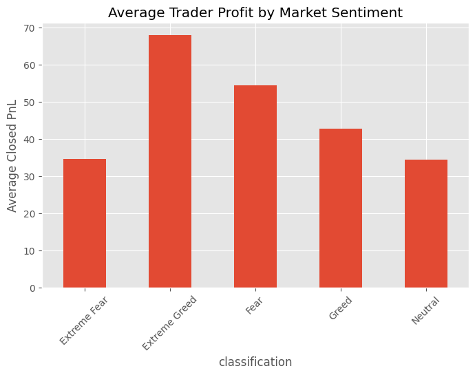

# Bitcoin Market Sentiment vs Trader Behavior Analysis

## Objective

This project analyzes the relationship between Bitcoin market sentiment and trader behavior using historical Hyperliquid trading data and the Fear & Greed Index.

The goal is to identify how market sentiment influences:
- trader profitability
- trade frequency
- position sizing
- trading consistency
- behavioral patterns

and derive actionable insights that can support smarter trading strategies.

---

## Dataset Used

1. Historical Hyperliquid Trader Data
2. Bitcoin Fear & Greed Index Dataset

---

## Technologies Used

- Python
- Pandas
- Matplotlib
- Seaborn
- Jupyter Notebook

---

## Setup Instructions

Install required libraries:

```bash
pip install pandas matplotlib seaborn notebook
```

Run Jupyter Notebook:

```bash
jupyter notebook
```

Open:

```text
analysis.ipynb
```

and run all cells sequentially.

---

## Project Workflow

1. Data loading and inspection
2. Data cleaning and preprocessing
3. Timestamp conversion and dataset alignment
4. Feature engineering
5. Sentiment-based behavioral analysis
6. Trader segmentation
7. Actionable strategy insights

---

## Key Analyses Performed

- Profitability vs Market Sentiment
- Trade Frequency Analysis
- Position Size Analysis
- Buy/Sell Ratio Analysis
- Top Trader Behavioral Analysis
- Trader Segmentation:
  - Frequent vs Infrequent Traders
  - Consistent Winners vs Others

---

## Key Findings

- Moderate Fear and Greed conditions showed stronger trading activity and profitability than extreme sentiment phases.
- Top-performing traders reduced position sizes during Extreme Fear and Extreme Greed periods.
- Infrequent traders achieved higher average profitability than frequent traders.
- High win rates did not necessarily correspond to the highest average profitability.

---

## Actionable Insights

- Avoid excessive trading activity and focus on higher-conviction trades.
- Reduce position sizes during highly emotional market conditions.
- Favor stable trend environments over extreme sentiment phases.
- Evaluate trading performance using both profitability and risk-reward efficiency rather than win rate alone.

## Sample Visualizations


